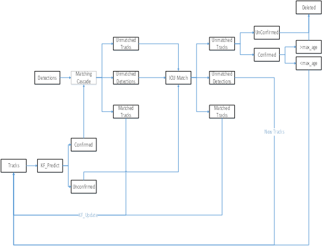

[deepsort原理详解](https://blog.csdn.net/didiaopao/article/details/120272947?utm_medium=distribute.pc_aggpage_search_result.none-task-blog-2~aggregatepage~first_rank_ecpm_v1~rank_v31_ecpm-1-120272947.pc_agg_new_rank&utm_term=%E7%9B%AE%E6%A0%87%E8%BF%BD%E8%B8%AAdeepsort&spm=1000.2123.3001.4430)

一、多目标追踪的主要步骤

获取原始视频帧
利用目标检测器对视频帧中的目标进行检测
将检测到的目标的框中的特征提取出来，该特征包括表观特征（方便特征对比避免ID switch）和运动特征（运动特征方便卡尔曼滤波对其进行预测）
计算前后两帧目标之前的匹配程度（利用匈牙利算法和级联匹配），为每个追踪到的目标分配ID。

二、sort流程

 Deepsort的前身是sort算法，sort算法的核心是卡尔曼滤波算法和匈牙利算法。

卡尔曼滤波算法作用：该算法的主要作用就是当前的一系列运动变量去预测下一时刻的运动变量，但是第一次的检测结果用来初始化卡尔曼滤波的运动变量。

匈牙利算法的作用：简单来讲就是解决分配问题，就是把一群检测框和卡尔曼预测的框做分配，让卡尔曼预测的框找到和自己最匹配的检测框，达到追踪的效果。

sort工作流程如下图所示：

Detections（下一帧）是通过目标检测到的框框。Tracks（上一帧）是轨迹信息。

整个算法的工作流程如下：

（1）将第一帧检测到的结果创建其对应的Tracks。将卡尔曼滤波的运动变量初始化，通过卡尔曼滤波预测其对应的框框。

（2）将该帧目标检测的框框和上一帧通过Tracks预测的框框一一进行IOU匹配，再通过IOU匹配的结果计算其代价矩阵（cost matrix，其计算方式是1-IOU）。

（3）将（2）中得到的所有的代价矩阵作为匈牙利算法的输入，得到线性的匹配的结果，这时候我们得到的结果有三种，第一种是Tracks失配（Unmatched Tracks），我们直接将失配的Tracks删除；第二种是Detections失配（Unmatched Detections）（当出现新目标时会出现这种情况），我们将这样的Detections初始化为一个新的Tracks（new Tracks）；第三种是检测框和预测的框框配对成功，这说明我们前一帧和后一帧追踪成功，将其对应的Detections通过卡尔曼滤波更新其对应的Tracks变量。

（4）反复循环（2）-（3）步骤，直到视频帧结束。
三、Deepsort算法流程

由于sort算法还是比较粗糙的追踪算法，当物体发生遮挡的时候，特别容易丢失自己的ID。而Deepsort算法在sort算法的基础上增加了级联匹配（Matching Cascade）和新轨迹的确认（confirmed）。Tracks分为确认态（confirmed），和不确认态（unconfirmed），新产生的Tracks是不确认态的；不确认态的Tracks必须要和Detections连续匹配一定的次数（默认是3）才可以转化成确认态。确认态的Tracks必须和Detections连续失配一定次数（默认30次），才会被删除。

Deepsort算法的工作流程如下图所示：

   整个算法的工作流程如下：

（1）将第一帧次检测到的结果创建其对应的Tracks。将卡尔曼滤波的运动变量初始化，通过卡尔曼滤波预测其对应的框框。这时候的Tracks一定是unconfirmed的。

（2）将该帧目标检测的框框和第上一帧通过Tracks预测的框框一一进行IOU匹配，再通过IOU匹配的结果计算其代价矩阵（cost matrix，其计算方式是1-IOU）。

（3）将（2）中得到的所有的代价矩阵作为匈牙利算法的输入，得到线性的匹配的结果，这时候我们得到的结果有三种，第一种是Tracks失配（Unmatched Tracks），我们直接将失配的Tracks（因为这个Tracks是不确定态了，如果是确定态的话则要连续达到一定的次数（默认30次）才可以删除）删除；第二种是Detections失配（Unmatched Detections），我们将这样的Detections初始化为一个新的Tracks（new Tracks）；第三种是检测框和预测的框框配对成功，这说明我们前一帧和后一帧追踪成功，将其对应的Detections通过卡尔曼滤波更新其对应的Tracks变量。

（4）反复循环（2）-（3）步骤，直到出现确认态（confirmed）的Tracks或者视频帧结束。

（5）通过卡尔曼滤波预测其确认态的Tracks和不确认态的Tracks对应的框框。将确认态的Tracks的框框和是Detections进行级联匹配（之前每次只要Tracks匹配上都会保存Detections其的外观特征和运动信息，默认保存前100帧，利用外观特征和运动信息和Detections进行级联匹配,这么做是因为确认态（confirmed）的Tracks和Detections匹配的可能性更大）。

（6）进行级联匹配后有三种可能的结果。第一种，Tracks匹配，这样的Tracks通过卡尔曼滤波更新其对应的Tracks变量。第二第三种是Detections和Tracks失配，这时将之前的不确认状态的Tracks和失配的Tracks一起和Unmatched Detections一一进行IOU匹配，再通过IOU匹配的结果计算其代价矩阵（cost matrix，其计算方式是1-IOU）。

（7）将（6）中得到的所有的代价矩阵作为匈牙利算法的输入，得到线性的匹配的结果，这时候我们得到的结果有三种，第一种是Tracks失配（Unmatched Tracks），我们直接将失配的Tracks（因为这个Tracks是不确定态了，如果是确定态的话则要连续达到一定的次数（默认30次）才可以删除）删除；第二种是Detections失配（Unmatched Detections），我们将这样的Detections初始化为一个新的Tracks（new Tracks）；第三种是检测框和预测的框框配对成功，这说明我们前一帧和后一帧追踪成功，将其对应的Detections通过卡尔曼滤波更新其对应的Tracks变量。

（8）反复循环（5）-（7）步骤，直到视频帧结束